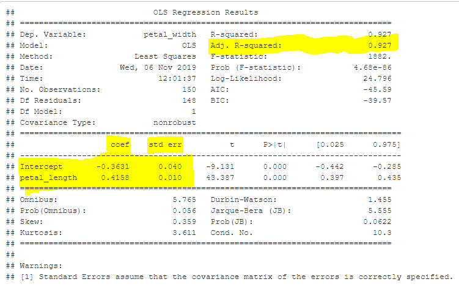
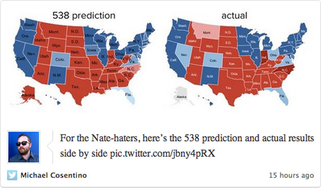
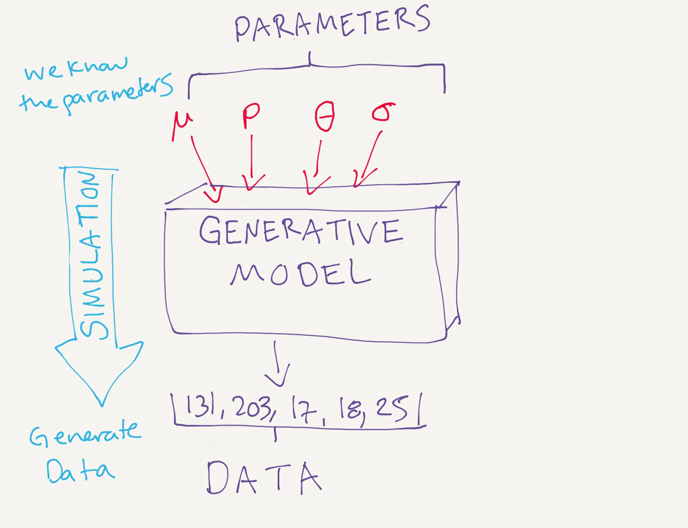
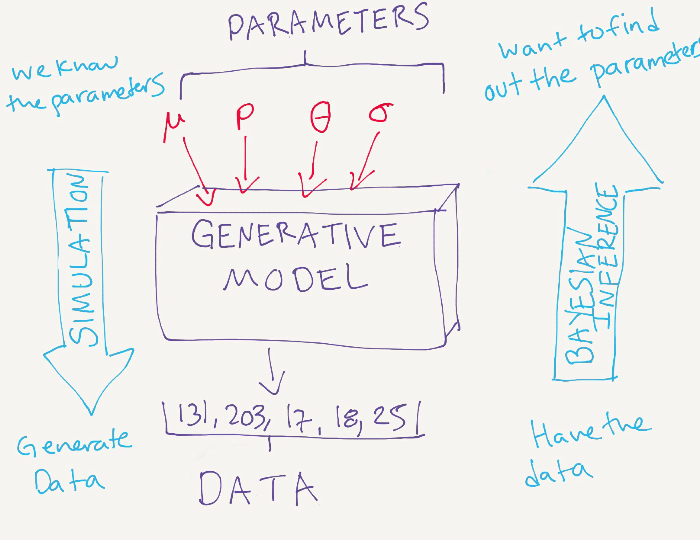
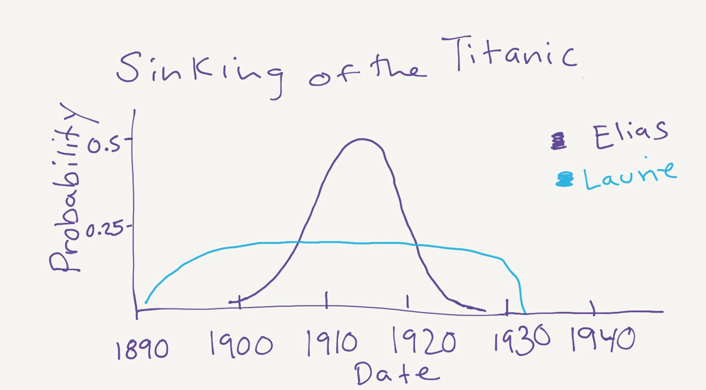

<style>

img[alt='logo']{
    width: 31%;
    height: auto;
}

.freqdist .figure{
  text-align: center;
}

.freqdist .figure img{
  width: 80%;
}

#flowChart{
  display: flex;
  flex-direction: row;
}

#flowChart .step{
  border: 3px solid black;
  padding: 15px;
  border-radius: 15px;
}

#flowChart .arrow{
  align-self: center;
  font-size: 30px;
}
</style>
```{r setup, include=FALSE}
knitr::opts_chunk$set(echo = TRUE)
```


```{r data science campus graphic, echo=FALSE}
htmltools::img(src = knitr::image_uri("pictures/DataScienceCampus.png"), 
               alt = 'logo', 
               style = 'position:absolute; top:0; right:0; padding:10px;')
```

<br> 

**Audience:** Diverse Background

<br>

**Time:** 3 day workshop (18 hours)

<br>

**Pre-Requisites:** Intro to Python (Data Science Campus).

<br>

**Brief Description:** 

This course introduces the basics of carrying out a statistical analysis in Python. It covers exploratory data analysis, constructing and interpreting linear and generalized linear models, and introduces Bayesian modelling. 

**Aims, Objectives and Intended Learning Outcomes:** 

<br>
**Chapter 1: Exploratory Data Analysis**
By the end of Chapter 1, learners should know:

*   What is tidy data?
    *   What is a variable, value, and observation?
    *   Several python commands to explore the structure of the data
    *   What is the difference between a continuous and categorical variable?
    *   What is variation and covariation?
*  Where Exploratory Data Analysis fits within data analysis?
    *   How to use plots to explore variation in 
        *	A continuous variable
        *	A categorical variable
    *   How to use plots to explore covariation between
        *	Two categorical variables
        *	Two continuous variables
        *	A categorical and continuous variable. 

**Chapter 2: Model Basics**
By the end of Chapter 2, learners should know:

*   Model Basics
    *	 What is a model family and fitted model?
    *	 What is the difference between a response and an explanatory variable?
    
*   Model Construction
    *  How to construct a linear model in python?
    *  What are the slope and intercept in a linear model?
    *  Picking out key information from the model table
    *  How to extract specific parameters from the model object.

*  Assessing Model Fit
    *	 How to inspect model residuals to assess model fit?
    *	 How to pick out key information from the table from a fitted model. 
    *  How to use Adjusted R-squared and AIC to compare models. 

**Chapter 3: Generalized Linear Models**

By the end of Chapter 3, learners should know

* What is probability? 

* What is a random variable?

* What a probability distribution is and how it differs for continuous vs. discrete random variables?
* Be familiar with several common probability distributions used to model variation in the response variable
  * Binomial
  * Normal
  * Poisson
  * Negative Binomial

* How to implement a generalized linear model in python.

**Chapter 4: Bayesian Analysis**
By the end of Chapter 4, learners should know

* What is Baye's rule and how it is used in Bayesian statistics?
* How Bayesian and Frequentist schools of thought differ?
* How to implement a simple Bayesian linear model in python.


**Acknowledgements:** Many thanks to Dr. Paraskevi Pericleous for key initial work on this module. Many thanks to Daniel J. Lewis for preparing the GLM and Bayesian Practical. 


**Libraries Needed** 

<br>

```{python Importing packages setting plot defaults}
import numpy as np # linear algebra
import pandas as pd # data processing
import matplotlib.pyplot as plt # data plotting
import seaborn as sns # data visualisation and plotting
import statsmodels.api as sm # statistical modelling package
import statsmodels.formula.api as smf # statistical modelling package with R-like formulas
import scipy.stats as stats
import math

#sns.set(color_codes=True)

from statsmodels.genmod.generalized_linear_model import GLM # importing packages to run GLM
from statsmodels.genmod import families # importing families for exponential families
from scipy.stats import binom # to illustrate the binomial distribution.
from sklearn import datasets, linear_model # fetching iris dataset and linear model functions
from sklearn.metrics import mean_squared_error, r2_score

# Seaborn plot default configurations
sns.set_style("white")

# set the custom size for my graphs
sns.set(rc={'figure.figsize':(8.7,6.27)})


```


```{r Call reticulate library to include python code chunks, echo=FALSE}
library(reticulate)
matplotlib <- import("matplotlib", convert = TRUE) 
matplotlib$use("Agg")
use_python("/Library/Frameworks/Python.framework/Versions/3.7/bin/python3")
```

# Introduction

The road map of the modelling process, adapted from [*Ecological Models and Data with R*](https://ms.mcmaster.ca/~bolker/emdbook/book.pdf) by Ben Bolker. 


{width=650px}


1. **Identify the data science question you wish to explore.** Try to identify your question at both a general, conceptual level "Are bed nets an effective intervention against malaria" and at a specific level "what is the percentage reduction in malaria cases between area A where bed nets are being used and area B where bed nets are not being used".

2. **Explore the data.** Explore the variation and covariation in the data. Identify patterns through plotting which can be explored further using formal statistical testing. 

3. **Choose the model:** choose the mathematical description of the pattern you are trying to describe. 

4. **Fit parameters:** once you have defined your model, you can estimate the parameters (slope, intercept, ...). The parameters are effectively the answers to your questions from **1**. 

5. **Estimate confidence intervals/test hypotheses/select models:** measurements of uncertainty are necessary to contextualise your best-fit parameters. By quantifying the uncertainty in the fit of a model, you can estimate confidence limits for the parameters. You can then test your hypothesis statistially and practically, can we tell the difference statistically between the effect of bed nets to control malaria? Are these differences large enough to make bed nets an effective intervention strategy?


# Chapter 1: Exploratory Data Analysis


## Introduction

Exploratory data analysis is a fluid process and there is no single approach. It can be thought of a process of hypothesis generation, data exploration, and formal statistical testing. It comes after the stage of importing and tidying your data.


In this section we will walk through organising your data, getting to know your data structure, and understanding variation and covariation within and between variables.  


For these exercises we will use the **iris** dataset, which consists of morphological measurements of three related species of iris flowers.

{width=650px}


The data is provided as a built-in dataset in the sklearn package which we will change to be formatted as a pandas dataframe. 


### Tidying your data

To conduct regression analyses in python it is important to have your data in a format that is easy to work with. A good approach is to organise your data as tabular data. 

Tabular data is a set of values, where each `value` is placed in its own “cell”, each `variable` in its own column, and each `observation` in its own row. The book [*R for Data Science*](https://r4ds.had.co.nz/) by Garrett Grolemund and Hadley Wickham is a great resource when thinking about tidying data. Here, we use some of the definitions they set out in the book to describe tidy data. 

**Some definitions for tidy data**:

 * A `variable` is a quantity, quality, or property that you can measure.

 * A `value` is the state of a variable when you measure it. The value of a variable may change from measurement to measurement.

 * An `observation` is a set of measurements made under similar conditions (you usually make all of the measurements in an observation at the same time and on the same object). An observation will contain several values, each associated with a different variable.

  * In python, the *pandas* package makes it easy to format your data in a tabular format. 
  

**Reading in the data**

```{python Function to read in the data}


# Define sklearn_to_df function to convert from sklearn to a pandas dataframes

def sklearn_to_df(sklearn_dataset):
    df = pd.DataFrame(sklearn_dataset.data, columns=sklearn_dataset.feature_names)
    df['target'] = pd.Categorical.from_codes(sklearn_dataset.target, sklearn_dataset.target_names)
    return df

```

**Importing and converting iris data to a pandas dataframe**
```{python Importing and converting iris data to a pandas dataframe}

# import and convert format of iris data from sklearn
df_iris = sklearn_to_df(datasets.load_iris())

```
  
**Looking at the head of the dataframe spot the tidy data**
```{python Head of Dataframe, echo = TRUE, eval = FALSE}

df_iris.head(5)


```

{width=650px}

**Exercise**

1. Looking at the definitions for `value`, `observation`, and `variable`. Which of the coloured boxes in the image above correspond to each definition?

```{r, echo = F}

# Answer: 

# Every value is in its own cell (red), 
# Every variable is in its own column (green)
# Every observation (blue) is in its own row.
```


   


## Getting to know your data

To get started, let's explore the following questions for our dataset. 

 1. What is the structure of the data?

 2. What type of variation occurs within my variables?

 3. What type of covariation occurs between my variables? 
 

### Data Structure and Data Summaries

One of the things we will wish to know about our variables are whether they are continuous or categorical. 

   * `Continuous variable`: a variable that can take on an unlimited number of values between the lowest and highest points of measurements.
        * e.g. speed, distance, height
        
        
  * `Categorical variable` can take **one** of a limited subset of values. For example, if you have a dataset about a household then you will typically find variables like gender, marriage status, and county.
      * In python, categorical variables are usually stored as character strings or integers (e.g. 'M' and 'F' for male and female). 
      * Categorical variables are **nominal** if they have no order (e.g. 'Ghana' and 'Uruguay')
      * Categorical variables are **ordinal** if there is an order associated with them (e.g. 'low', 'medium', and 'high' referring to economic status).         
        

**Exercises** 

Run the following lines of code to answer the questions below

1. What are the dimensions of the dataframe?

```{python Dataframe Dimensions, eval = FALSE}
print(df_iris.shape)

```

2. What are the first and last values of sepal.length?


```{python Head and Tail of Data, eval = FALSE}

df_iris.head(5)

df_iris.tail(5)
```

3. Which variables are float64s or objects?


```{python Data Structure, eval = FALSE}
df_iris.info()
```

 4. Using the data summary, what is the minimum and maximum sepal length?


```{python Data Summary, eval = FALSE}

df_iris.describe()

```


 5. What are the names of the columns?

```{python Column Names, echo = T, results = 'hide'}

# Let's simplify the column names and make them more meaningful

df_iris = df_iris.rename(columns = {'sepal length (cm)': 'sepal_length', 'sepal width (cm)': 'sepal_width', 'petal length (cm)': 'petal_length', 'petal width (cm)': 'petal_width','target': 'species'})

# What are the names of the columns?

df_iris.columns

```


### Variation

Now we know more about the structure of our data we can explore the variation and covariation in the variables. Knowing the variation and covariation between variables can help us to understand the spread of the data and potential relationships in the data that may give insight into modelling. 

**Terms:**

  * `variation`: is the tendency of values of a variable to change from measurement to measurement. Variation can come in several forms: 
    - `measurement error` you may measure the same thing twice and get slightly different values.
    - `natural variation` is the term I use to refer to variation that is inherent in a population or sample (e.g. as humans we all have different heights, the way these values vary reflect the variation in the sample or population).

  * `covariation`: tendency of values of a variable to change with the values of another variable. 

Visualisation is a great initial tool to explore these relationships further.

### Visualising Distributions

How you visualise your variables depends on if the variable is `categorical` or `continuous`.

**A categorical variable** 

   * `Categorical or discrete variable`: a variable that can take on one of a limited, usually fixed number of possible values, assigning each value to a particular group or nominal category. 
        * e.g. sex, race, density: (high, medium, low)
  
To examine the distribution of a categorical variable, we can use a bar plot:

  * Bar plots are a useful tool for getting to know how many observations are within each group of a category. 

**Bar plot of species**
```{python Bar plot of species}

species_counts = sns.countplot(x= "species", data = df_iris)
species_counts

```

In this case, the bar chart shows that there are the same number of measurements for each species in the data set.

**A continuous variable**

  * A `continuous variable` can take any of an infinite set of ordered values (e.g. numbers and date times). We can inspect the spread of the data using a density plot or box plot. 

```{python Distribution plot of Petal Length}
petal_length_all_distplot = sns.distplot(df_iris['petal_length'], 
              hist = False, kde = True, kde_kws = {'shade': True, 'linewidth': 3})
petal_length_all_distplot.set(xlabel='Petal_length', ylabel='Density')
petal_length_all_distplot

```

If we look at the distribution of petal length, something interesting seems to be happening. It appears that the distribution is *bimodal* meaning that there are two modes, in this case two maxima, in the data. 

Let's see if we can explore it further.


```{python Distribution plot of each species}
df_setosa = df_iris[df_iris.species == 'setosa']
petal_length_species = sns.distplot(df_setosa[['petal_length']], label = 'setosa', 
              hist = False, kde = True, kde_kws = {'shade': True, 'linewidth': 3})

df_virginica = df_iris[df_iris.species == 'virginica']
petal_length_species = sns.distplot(df_virginica[['petal_length']], label = 'virginica', 
              hist = False, kde = True, kde_kws = {'shade': True, 'linewidth': 3})

df_versicolor = df_iris[df_iris.species == 'versicolor']
petal_length_species = sns.distplot(df_versicolor[['petal_length']], label = 'versicolor', 
              hist = False, kde = True, kde_kws = {'shade': True, 'linewidth': 3})


petal_length_species.set(xlabel='Petal Length', ylabel='Density x 10')
petal_length_species
```


### Covariation


**A continuous and categorical variable**

 * **Box plot of petal width by species**

```{python Boxplot of petal width}
petal_width_boxplot = sns.boxplot(data = df_iris, y = 'petal_width', x = 'species')
petal_width_boxplot

```


* A box plot gives us a visual representation of the distribution of numeric data using quartiles. It can be a good way to see how the data is spread and to identify potential outliers. 
    * The box plot shows the median (second quartile) in the middle of the plot.
    * The first and third quartile represent the interquartile range (25\% to 75\%). 
    * The minimum and maximum are defined as the (Q1 - 1.5 x IQ) and (Q3 + 1.5 x IQ).


* **Violin plots of sepal length for each species**

```{python Violin plot of sepal length by species}

sepal_length_violin = sns.violinplot(data = df_iris, y = "sepal_length", x = 'species')
sepal_length_violin
```

Violin plots are similar to box plots, but they also show the probability density of the data at different values, usually smoothed by a kernel density estimator. 

**Two continuous variables**

Plotting two continuous variables, we can see how they change in relation to eachother. In these plots we are looking to see whether there is a 

* **positive relationship** as one variable increases the other variable increases

* **negative relationship** as one variable increases the other decreases

* **no relationship** no discernable pattern of change in one variable with the other.

* **non-linear relationship** we may also be able to pick out other patterns, e.g. *polynomials*. 


```{python Scatterplot of petal length and sepal width}

iris_scatter_petal_length_sepal_width = sns.scatterplot(data = df_iris, x = 'petal_length', y = 'sepal_width', hue = 'species')
iris_scatter_petal_length_sepal_width

```

**Exercise**

1. Make a box plot or a violin plot of sepal width by species. How does this box plot/violin plot compare to the earlier box plot/violin plot we made of petal width and sepal length?

2. Make a scatterplot to visualise the relationship between petal length and sepal length coloured by species. What patterns can you pick out from the data?

3. Pairplots can be a quick and useful way to summarise your dataset quickly and to inspect the relationships simultaneously.Trying running the following code to make a pairplot. What does this code do?

```{python Pairplot of the data, echo = TRUE, eval = FALSE}
iris_all_pairplot = sns.pairplot(data = df_iris, hue="species", diag_kind="kde")
iris_all_pairplot


```

# Chapter 2: Model Basics

## Introduction

 * Ideally your model will capture `signals` (i.e. patterns) generated by the phenomenom of interest and ignore `noise` (i.e. random variation) you're not interested in. 
 
 * In model basics you will learn how models work mechanistically, focussing on the important family of linear models. 
 
**Hypothesis generation vs. hypothesis confirmation**

  * Traditionally, one of the focuses of modelling is on **inference**, or confirming that a hypothesis is true. To do it correctly you need to know two things:
  
    1. Each observation can either be used for exploration or confirmation, not both. 
    2. You can use an observation as many times as you like for exploration, but you can only use it once for confirmation. As soon as you use an observation twice, you've switched from confirmation to exploration. 
    
* Note, that in order to confirm a hypothesis, you must use data independent of the data used to generate the hypothesis.


## Model basics

One of the goals of models is to partition data into patterns and residuals. Strong patterns will hide subtler trends. We can use models to peel back layers of structure as we explore a dataset. 

There are 2 key parts to a model, the family of models and the fitted model.
 

 1. **Family of models**
    * define a family of models that express precise, but generic pattern you wish to capture. For example, a straight line $y = ax + b$ or quadratic curve $y = ax^2 + bx + c$. Where $x$ and $y$ are known variables from your data, and $a$, $b$, and $c$ are parameters that can vary to capture different patterns. These formulas are simple to capture in python 
    
    <br>
    
     by [Frau Heimlich](https://www.flickr.com/photos/34379543@N06) is licensed under [CC BY-NC-SA 2.0](https://creativecommons.org/licenses/by-nc-sa/2.0/?ref=ccsearch&atype=rich)</font>](pictures/clothesline.jpg){width=350px} 

<br>

 2. **Fitted model**
    * After you've chosen your model family, the next step is to generate a fitted model from that family that is closest to your data. 
    * the **model family** is expressed as an equation, where the different parameters are able to take on different values to adjust the shape of the fitted line to the data.
    
    <br>
    
     by Shayna Grosh is licensed under [CC BY-NC-ND 4.0](https://creativecommons.org/licenses/by-nc-nd/4.0/?ref=ccsearch&atype=rich) </font>](pictures/tailor_fit.jpg){width=350px}

<br>

Note, it is important to understand that a fitted model is just the closest model from a family of models. What is "best" is determined according to some criteria, which we will discuss later.  

**Clothes as an analogy**

If we use clothes as an analogy, the **family of models** is like an assortment of garments you could choose to 'clothe' the data in. Just as some clothes will be more suitable than others depending on what you wish to do (e.g. nice dress to a wedding), the same is true for models. The type of model will depend on the type of data you have and what you wish to do with your analysis. 

**Model fitting** is similar to getting a garment tailored. Just as you might make alterations to improve the fit of a garment, you will adapt the chosen model to get a better fit to the data. 


**Terminology**

In the field of data science you will see a number of terms used to refer to the same things. Here, we will use `response variable` to refer to the measured variable you are trying to explain. 

We will use `explanatory variables` to refer to the measured variables that we use to try to explain the response variable. Other terms that you may come across for these concepts include:

 * **response variable**: `dependent`, `target` (machine learning) 
 
 * **explanatory variables**: `independent`, `features` (machine learning)


## Linear Models

Linear regression is one of the most important and widely used regression techniques. Its main advantage is its simple structure and ease of interpreting results.

Linear models take the mathematical form:

$y = ax + b$

where $y$ is the response variable, $a$ is the slope that quantifies the change in $y$ with increases in the dependent variable $x$, and $b$ is the intercept.

**Selling irises to nostalgic students**

{width=650px}

A data scientist is setting up a side business of breeding irises to sell to ex-statistics undergraduates who have rosy nostalgic memories of studying the iris dataset when they were budding statisticians. They are interested in the relationship between petal width and other metrics, like petal length, as they find that the irises with the widest petals sell better. 


Let's take a closer look at the iris data to explore the relationship between petal length and petal width.

```{python Scatterplot of petal length and petal width}

iris_scatter_petal_length_width = sns.scatterplot(data = df_iris, x = 'petal_length', y = 'petal_width', hue = 'species')
iris_scatter_petal_length_width

```

From the plot it looks like there is a positive relationship between petal length and petal width. Let's use a model to capture the pattern and make it more explicit. In this case, the relationship looks linear so we can use the form: $y = ax + b$. We are interested in how petal width changes with petal length. We can make a guess at what the parameters for a and b might be. It looks like petal width increases more slowly than petal length, maybe at 0.3 cm for every 1 cm in petal length. 


```{python Scatterplot with 1 potential line to describe relationship}

iris_scatter_petal_length_width = sns.scatterplot(data = df_iris, x = 'petal_length', y = 'petal_width', hue = 'species')

x = np.arange(7)
a = 0.3
b = 0.1
y = a*x + b


iris_scatter_petal_length_width = sns.regplot(x=x, y=y, marker="+")
iris_scatter_petal_length_width

```

Not bad, but maybe we could do a bit better. 

```{python Scatterplot with two potential lines with different values for the slope and intercept.}

iris_scatter_petal_length_width = sns.scatterplot(data = df_iris, x = 'petal_length', y = 'petal_width', hue = 'species')

x = np.arange(7)
a = 0.37
a1 = 0.35
b = -0.2
b1 = -0.3
y = a*x + b
y1 = a1*x + b1

iris_scatter_petal_length_width = sns.regplot(x=x, y=y, marker="+")
iris_scatter_petal_length_width = sns.regplot(x=x, y=y1, marker="+", line_kws={"color": "red"})
iris_scatter_petal_length_width

```


The two lines have slightly different parameters. It is difficult to tell by eye which line fits the data better. We could do this ourselves, by measuring the `residuals`, the distance from the data (actual response) to the line (predicted response), for each model, and comparing them. But this can be time-consuming, especially if our goal is to find the best model which could involve looking at more than just two models! 


Luckily python has built-in functions that will explore all the possibilities to find the 'best' line. In linear regression, one of the ways to define the 'best' line is by finding the line that minimizes the sum of squared residuals (aka sum of squares). 

Calculating the sum of squared residuals involves taking the residual distances, squaring them, and summing them. This approach is also called Ordinary Least Squares (OLS), after which the OLS function in python takes its name. 


### Model Construction

Here we use the `statsmodels function api` to construct our models. This allows us to specify an intuitive model formula for our analyses where `formula = y ~ x`. 

In this case `y` is our response variable, the tilde \tilde means "depends on" `x`, which represents an explanatory variable (i.e. the variable we are using to try to explain the variation in y). 

#### Model 1: Continuous Variable

Let's take a look at what this looks like in practice. In this case we're interested in explaining the variation in `petal_width` using the explantory variable, `petal_length`.

Note that the smf.ols function automatically includes the intercept in the model, so we don't have to specify one.

```{python Model 1 specification and model fit}

model1 = smf.ols(formula = 'petal_width ~ petal_length', data = df_iris)

results_mod1 = model1.fit()

print(results_mod1.summary())
```

The summary gives us a range of diagnostic information about the model we've fitted, split into three tables. Here's a quick guide on what is included:

**Top Table - model fit info.**

  * **R-squared/Adj. R-squared** - The proportion of the variance in the response variable ('petal_width') explained by the model. The Adj. R-squared takes into account the number of variables in the model.
  * **No. of Observations** (i.e. measurements of 'petal_width') and  **Df** degrees of freedom (No. of Observations - (1 + No. of variables in the model)).
  * **General info** - date and time that model was run, type of model etc.
  * **Model Fit info** - inc. **F-statistic**, **AIC** and **BIC**, **Log-Likelihood**. They are not meaningful on their own, but allow you to compare different models to assess the best one. 
    
**Middle Table - an important table!**

  * **coef** = coefficient estimates for the intercept and explanatory variables.
  * **std err** = standard errors (i.e. estimate of the uncertainty) of the coefficient estimates.
  * **t** = t-statistic for the t-test comparing whether the coefficient is different to 0.
  * **P>|t|** = p-value for the t statistics, giving significance of coefficient.
  * **[0.025 0.975]** = 95% confidence interval around the coefficient estimate.
    
**Bottom table - Diagnostics**

  * **Jarque-Bera**, **Omnibus**: test normality of residuals.
  * **Cond, No.**: Condition Number, test for multicollinearity.
  * **Durbin-Watson**: test for autocorrelation.


As you can see, there is a lot of information in the summary. Let's focus on a few relevant values from the model to focus on.


{width=700px}

We can get these specific parameters directly from the `model` object.


* **Intercept**

```{python Extracting parameters directly from the model 1 object Intercept}

print("Intercept = ",results_mod1.params['Intercept'])

```

* **Slope**

```{python Extracting parameters directly from the model 1 object Slope}

print("(Petal length) coef. = ", results_mod1.params['petal_length'])

```

* **R-squared**
```{python Extracting parameters directly from the model 1 object R-squared}

print("R^2 = ", results_mod1.rsquared_adj)

```

**Constructing the line of best fit**

This is a useful way to pull out information to further analyse or include in reports. We can pull out these coefficients to plot our line of best fit. 

```{python Scatterplot of line of best fit compared to two different slope and intercept to describe relationship between petal width and petal length}

iris_scatter = sns.scatterplot(data = df_iris, x = 'petal_length', y = 'petal_width', hue = 'species')

x = np.arange(7)
a = 0.37
a1 = 0.35

b = -0.2
b1 = -0.3

y = a*x + b
y1 = a1*x + b1
y2 = results_mod1.params['petal_length']*x + results_mod1.params['Intercept']

iris_scatter = sns.regplot(x = x, y = y, marker="+")
iris_scatter = sns.regplot(x = x, y = y1, marker="+", line_kws = {"color": "red"})
iris_scatter = sns.regplot(x = x, y = y2, marker = "+", line_kws = {"color": "blue"})
iris_scatter

```

We can do this plot by hand (as above) or directly from our model. 

```{python Model 1 scatterplot and line of best fit}

iris_best_fit = sns.regplot(x = 'petal_length', y = 'petal_width', ci = 95, data = df_iris)
iris_best_fit


```


**Residuals**

```{python Scatterplot of residuals}
fig, ax2 = plt.subplots(figsize = (8,5))

x = df_iris.petal_length
y = df_iris.petal_width

xfit = np.arange(8)
yfit = results_mod1.params['petal_length']*xfit + results_mod1.params['Intercept']

slope = results_mod1.params['petal_length']
intercept = results_mod1.params['Intercept']

# Plot
ax2.scatter(x,y, marker = 'x', color = 'k')
ax2.plot(xfit, yfit, color = 'r')
# plot residuals
def residual_line(x, y, slope, intercept):
    xs = [x, x]
    ys = [y, (intercept + slope * x)]
    return xs, ys
errs = [ax2.plot(*residual_line(x, y, slope, intercept), color = '0.5')]
ax2.set_xlabel("$X $", fontsize = 12)
ax2.set_ylabel("$Y $", fontsize = 12);
```

```{python Hand calculated residuals and plot residuals}
actual = df_iris.petal_width
predicted = results_mod1.params['petal_length']*df_iris.petal_length + results_mod1.params['Intercept']
difference = actual-predicted

x = df_iris.petal_length

fig, resid_plot = plt.subplots(figsize = (8,5))

resid_plot.scatter(x, difference, marker = 'o', color = 'k')
resid_plot.set_xlabel("Petal Length", fontsize = 12)
resid_plot.set_ylabel("Residuals", fontsize = 12);

```

```{python Hand calculated sum of residuals}

# To get the sum of squared residuals we need to take the difference squared and then the square root.

difference_squared = difference**2
residuals = difference_squared.apply(math.sqrt)


print(residuals.sum())

```


**Residuals**

We can then inspect the residuals in the model. `Residuals` represent the left over variation in the response variable not explained by the model. A pattern in the residuals may indicate that we are missing a variable or that our assumption of normality is  incorrect. When we are looking at the residuals, we want them to form an 'amorphous cloud', i.e. a cloud shape with no patterns. 


```{python Residual plot for Model 1}
df_iris_resid = sns.residplot(y = 'petal_width', x = 'petal_length', data = df_iris)
df_iris_resid

```

It looks like there might be some patterns left in the data that are unexplained. We can see that as `petal_length` increases the variability and range of residual values also increase.

**Checking for normality of the residuals**

One of the assumptions of a linear model is that the residuals are normally distributed. Note that this does not mean that the response variable needs to come from a normal distribution, just that the residuals are normally distributed. Normal distributions are often referred to as bell curves because of their shape. Let's take a look at a normal distribution with mean 0 and variance 1. 

**Normal** 

```{python}
mu = 0
variance = 1
sigma = math.sqrt(variance)
x = np.linspace(mu - 3*sigma, mu + 3*sigma, 100)
plt.plot(x, stats.norm.pdf(x, mu, sigma))
plt.xlabel('Value')
plt.ylabel('Density')
plt.show()

```


What you'll notice in the plot above is that it is symetrical with most values falling close to 0. 


A common plot used to inspect model residuals is a qqplot. The qqplot compares the residuals to a theoretical normal distribution. If the residuals come from a normal distribution we would expect the blue dots to line up with the red line. 

```{python qqplot for Model 1}
resid = results_mod1.resid

# Use statsmodels qqplot to graph residuals
# make a figure and an axis
f, ax = plt.subplots(figsize=(7,7))
# call the qqplot graph from statsmodels 'graphics' module.
# fits against the normal distribution as standard.
sm.graphics.qqplot(resid, line='45', fit=True, ax=ax);
```


The plot doesn't look too bad. The residuals mostly match the red line, but we can see that the tails of the qqplot are a little skewed, particularly to the right. This may mean that there is still some structure in the variation in `petal_width` that is not accounted for by `petal_length`.  We can see whether including species in the model helps explain some of the remaining variation in the model. 

#### Model 2: Continuous and Categorical Variables

Now we are constructing our model to explain the variation in `petal_width` using the variables for `petal_length` and `species`. In this case, because species is a categorical variable we can specify it using `C(species)`.


```{python Model 2 specification and model fit}

model2 = smf.ols(formula = 'petal_width ~ petal_length + C(species)', data = df_iris)

results_mod2 = model2.fit()

print(results_mod2.summary())
```


There are a few key things to pick out from the table above. First, we have an increase in the adjusted R^2, which is now 0.944, meaning we've explained 94.4 \% of the variation in petal_length. We also have several variables now:

 * `Intercept`
 * `C(species)[T.versicolor]`
 * `C(species)[T.virginica]`
 * `petal_length`
 
 
But remember that in our `df_iris` dataset there are three species of iris: 

* setosa

* versicolor

* virginica

Categorical variables always contribute to the intercept in a linear model. When fitting the model, the model function uses the first level of the categorical variable, in this case `setosa`, as the baseline `Intercept`. The coefficients estimated for `C(species)[T.versicolor]` and `C(species)[T.virginica]` are estimated in relation to that. 

Let's see how our fit looks when it is plotted.


```{python Scatterplot and line of best fit for Model 2}

iris_scatter_species = sns.scatterplot(data = df_iris, x = 'petal_length', y = 'petal_width', hue = 'species')

x = np.arange(7)
a = results_mod2.params['petal_length']

b_setosa = results_mod2.params['Intercept']
b_virginica = results_mod2.params['C(species)[T.virginica]'] + results_mod2.params['Intercept']
b_versicolor = results_mod2.params['C(species)[T.versicolor]']  + results_mod2.params['Intercept']


y_setosa = a*x + b_setosa
y_virginica = a*x + b_virginica
y_versicolor = a*x + b_versicolor

iris_scatter_species = sns.regplot(x = x, y = y_setosa, marker="+", line_kws = {"color": "blue"})
iris_scatter_species = sns.regplot(x = x, y = y_virginica, marker = "+", line_kws = {"color": "green"})
iris_scatter_species = sns.regplot(x = x, y = y_versicolor, marker = "+", line_kws = {"color": "orange"})

iris_scatter_species

```

As you can see from the plot above, all of the lines have the same slope so that they are parallel to one another. The only thing that changes is the intercept which moves the fitted line up or down.

Let's see what the residuals look like for our new model.


```{python Residuals for Model 2}
resid2 = results_mod2.resid
fitted2 = results_mod2.fittedvalues

resid2_plot = sns.scatterplot(x = fitted2, y = resid2)
resid2_plot.set(xlabel='Fitted', ylabel='Residuals')
resid2_plot

```

Let's inspect the qqplot

```{python qqplot for Model 2}

# Use statsmodels qqplot to graph errors
# make a figure and an axis
f, ax = plt.subplots(figsize=(7,7))
# call the qqplot graph from statsmodels 'graphics' module.
# fits against the normal distribution as standard.

sm.graphics.qqplot(resid2, line='45', fit=True, ax=ax);
```


Now our residuals are slightly skewed to the left. Is there something more we might be missing from the model? 

#### Model 3: Interactions

So far we've allowed the intercept in our model to vary by species. Let's try letting our slope change also with species. By allowing our slope to vary by species we are exploring the hypothesis that **how** `petal_width` **changes** with `petal_length` varies by species. 

To do this in the model, we need to use an interaction term. Interactions are included using the multiplication symbol $*$ between two variables.


```{python Model 3 specification and resulting model fit}

model3 = smf.ols(formula = 'petal_width ~ petal_length*C(species)', data = df_iris)

results_mod3 = model3.fit()

print(results_mod3.summary())
```

If we look at the results, we can see that the slope for `petal_length` also uses setosa (the species name that is missing) as a baseline.


We can plot the model fit using our new coefficients. This time, both the slope and intercept will vary. 


```{python Scatterplot and line of best fit for Model 3}

iris_scatter_species = sns.scatterplot(data = df_iris, x = 'petal_length', y = 'petal_width', hue = 'species')

x = np.arange(7)

##Slope
a_setosa = results_mod3.params['petal_length']

a_virginica = results_mod3.params['petal_length:C(species)[T.virginica]'] + results_mod3.params['petal_length']

a_versicolor = results_mod3.params['petal_length:C(species)[T.versicolor]'] + results_mod3.params['petal_length']

## Intercept
b_setosa = results_mod3.params['Intercept']

b_virginica = results_mod3.params['C(species)[T.virginica]'] + results_mod3.params['Intercept']

b_versicolor = results_mod3.params['C(species)[T.versicolor]'] + results_mod3.params['Intercept']

##Predicted Petal Width
y_setosa = a_setosa*x + b_setosa

y_virginica = a_virginica*x + b_virginica

y_versicolor = a_versicolor*x + b_versicolor

## Line of best fit

iris_scatter_species = sns.regplot(x = x, y = y_setosa, marker= "+", line_kws = {"color": "blue"})

iris_scatter_species = sns.regplot(x = x, y = y_virginica, marker = "+", line_kws = {"color": "green"})

iris_scatter_species = sns.regplot(x = x, y = y_versicolor, marker = "+", line_kws = {"color": "orange"})

iris_scatter_species

```

The residuals for the latest model are here:


```{python Residuals Model 3}

resid3 = results_mod3.resid
fitted3 = results_mod3.fittedvalues

resid3_plot = sns.scatterplot(x = fitted3, y = resid3)
resid3_plot.set(xlabel='Fitted', ylabel='Residuals')
resid3_plot

```

The qqplot for Model 3

```{python qqplot for Model 3, out.width = "500px", out.height = "400px"}

# Use statsmodels qqplot to graph errors
# make a figure and an axis
f, ax = plt.subplots(figsize=(7,7))
# call the qqplot graph from statsmodels 'graphics' module.
# fits against the normal distribution as standard.

sm.graphics.qqplot(resid3, line='45', fit=True, ax=ax);

```

### Model Comparison

So how can we decide which model is better? There are a few metrics we can compare between the model that can be found in the top table. The three main ones we will discuss in this course are the `Adjusted R^2`, `AIC`, and `BIC`. Before getting to these concepts, let's discuss the concept of `parsimony` and `Occam's Razor`.

**Occam's Razor: law of parsimony**

`Parsimony` (aka `Occam's razor`) is a general argument for choosing simpler models even though we know the world is complex. Occam's razor says that when presented with competing hypotheses that make the same predictions, we should select the solution with the fewest assumptions. This is to say that all other things being equal, we should prefer a simpler model to a more complex one, especially when the data don't tell a clear story. 

Model selection approaches often go beyond parsimony to say that a more complex model must not be just better than, but a specified amount better than, a simpler model.

**Practical Considerations**

There is also a practical element to parsimony; simple theories are easier to test than complex ones. Similarly, simple models often do a better job at predicting. Because a simpler model requires fewer parameters it is also less expensive in terms of time or money to collect the data for it. 

**We need to draw the line somewhere**

"With four parameters I can fit an elephant, and with five I can make him wiggle his trunk" ~ John Von Neumann


```{python, echo = FALSE}
#Author: Piotr A. Zolnierczuk (zolnierczukp at ornl dot gov)

#Based on a paper by:
#Drawing an elephant with four complex parameters
#Jurgen Mayer, Khaled Khairy, and Jonathon Howard,
#Am. J. Phys. 78, 648 (2010), DOI:10.1119/1.3254017


import numpy as np
import pylab

# elephant parameters
p1, p2, p3, p4 = (50 - 30j, 18 +  8j, 12 - 10j, -14 - 60j )
p5 = 40 + 20j # eyepiece

def fourier(t, C):
    f = np.zeros(t.shape)
    A, B = C.real, C.imag
    for k in range(len(C)):
        f = f + A[k]*np.cos(k*t) + B[k]*np.sin(k*t)
    return f

def elephant(t, p1, p2, p3, p4, p5):
    npar = 6
    Cx = np.zeros((npar,), dtype='complex')
    Cy = np.zeros((npar,), dtype='complex')

    Cx[1] = p1.real*1j
    Cx[2] = p2.real*1j
    Cx[3] = p3.real
    Cx[5] = p4.real

    Cy[1] = p4.imag + p1.imag*1j
    Cy[2] = p2.imag*1j
    Cy[3] = p3.imag*1j

    x = np.append(fourier(t,Cx), [-p5.imag])
    y = np.append(fourier(t,Cy), [p5.imag])

    return x,y

x, y = elephant(np.linspace(0,2*np.pi,1000), p1, p2, p3, p4, p5)
pylab.plot(y,-x,'.')
pylab.xlabel('x')
pylab.ylabel('y')
pylab.show()
```


As we add more parameters to a model, we necessarily get an increasingly accurate fit to the particular data we have observed (the bias of our predictions decreases), but our precision for predicting future observations decreases as well (the varaince of our predictions increases). 

One way to think about it is that data contain a fixed amount of information; as we estimate more and more parameters we spread the data thinner and thinner. Eventually the gain in accuracy from having more details in the model is outweighed by the loss in precision from estimating the effect of each of those details more poorly.

**Adjusted R^2**

R-squared is a goodness-of-fit measure for linear regression models. It indicates the percentage of the variance in the response variable explained by the explanatory variables. It is calculated by:


$\frac{\text{Variance explained by the model}}{ \text{Total variance}}$. 

**Likelihood**

The `likelihood` is the probability of the observed outcome (i.e. the data) given a particular choice of parameters. For a particular statistical model, maximum likelihood finds the set of parameters *that makes the observed data most likely to have occurred*. That is, we find the set of parameters that makes the likelihood as large as possible.

{width=650px}

The diagram above shows what is happening when you are calculating the maximum likelihood. Here, we have a line of best fit, with the estimated values of the response variable $\hat y_{1...n}$ (red dots). The actual values of the response variable (our data), are reperesented by the black dots. The residuals are indicated by the $\epsilon$. These residual is the distance between the actual value of the response variable and the estimated value of the response variable. 

When we are calculating the maximum likelihood, we are looking for the parameters that maximise the likelihood of the data. The horizontal arrows trace up to the normal distribution which represents the fit. The closer to the peak of the distribution the data falls the "more likely" the data is given the parameters. 

For mathematical convience, we often work with the logarithm of the likelihood (the *log-likelihood*) instead of the likelihood. However, the parameters that give the maximum log-likelihood also give the maximum likelihood. 

**Information criteria**

**Information criteria** are based on the expected distance between a particular model and the "true" model. All information-theoretic methods reduce to finding the model that minimizes some criterion that is the sum of a term based on the likelihood (usually twice the negative log-likelihood) and a *penalty term* which is different for different information criteria. 

Selecting models based on information criteria allows for the comparison of all candidate models at once, provided they are fit to the same data. If there are missing values in certain variables and not others, the model will exclude these data when fitting by default, so you need to be careful that you are not comparing models which have been fit to different datasets. 


 * **AIC**
The `Akaike Information Criterion`, or AIC, is the most widespread information criterion, and is defined as

$\text{AIC} = -2L + 2k$

where $L$ is the log-likelihood and $k$ is the number of parameters in the model. As with all information criteria, small values represent better overall fits; adding a parameter with a negligible improvement in fit penalizes the AIC by 2 log-likelihood units.


**Some rough guidance for AIC**

1. Lower values of AIC indicated a better fit to the data regardless of whether they are positive or negative.
    * If you have two models with AIC: -213.09, and -289.12. The model with AIC -289.12 is better.
2. AIC comparisons are only valid for models that are fit to the same response data (i.e. same y)

For AIC, the rule of thumb people generally follow is that improvements of greater than 2 mean we can select the more complicated model.

* **BIC**
The second most common information criterion, the *Bayesian* information criterion (BIC), uses a penalty term of $(log n)k$. The BIC is more conservative than the AIC, insisting on a greater improvement in fit before it will accept a more complex model. 

**Model Selection when there are several possibilities**

Models with multiple parameters and possible interactions between variable lead to a large number of models to try. Two simple approaches to model selection include:

* **forward selection** (add parameters one at a time to the simplest model)
* **backward selection** (subtract parameters from the most complex model). 

With too large a set of possibilities this can mean that you may arrive at a different best model depending on which approach you take. There are some algorithms to do a combination or forward and backward selection. However, you want to be careful that this kind of model selection does not devolve into data-dredging. 

You should:

1. Use common sense and domain knowledge to isolate the most important comparisons
2. Raw plots of the best candidate fits to try to understand why different models fit the data approximately equally well. 


**Exercises**

1. Let's compare the models we ran using Adjusted R^2 and AIC. Using the notes above, discuss in groups which model you think is best and why?

**Adjusted R^2**
```{python Model Comparison: Comparing Adjusted R2}

#\n will put the results on the next line!

print("Adjusted R^2 Model 1 = ", results_mod1.rsquared_adj, "\nAdjusted R^2 Model 2 = ", results_mod2.rsquared_adj
, "\nAdjusted R^2 Model 3 = ", results_mod3.rsquared_adj)

```

**AIC**
```{python Model Comparision: Comparing AIC}

print("AIC Model 1 = ", results_mod1.aic, "\nAIC Model 2 = ", results_mod2.aic, "\nAIC Model 3 = ", results_mod3.aic)

```

2. Take a look at the main parameters of Model 2 and Model 3 from the model summary tables. Do they seem to vary much between the models?

3. Starting with the basic model `sepal_width ~ sepal_length`, explore the variables that best explain the variation in `sepal_width` within your dataset. 

# Chapter 3: Generalized Linear Models

## Introduction

The traditional statistical approach was to assume that all variation in the data was normally distributed, or to transform the data until it was, and then use classical methods based on the normal distribution to draw conclusions. 

In generalized linear models, variability isn't just a nuisance, but actually tells us something about the processes we are interested in. What we treat as "signal" and what we treat as "noise"  depends on our question. The same source of variability might provide an interesting insight into the data or be something we wish to account for so we can explore it further. 

In the next section, we will introduce you to a few common distributions that capture different forms of variation in the response variable from the exponential family.

We will then give practical examples of how to fit and interpret these models using python. 

## Probability and Random Variables (Discrete and Continuous) 

**Why is probability important?**

Uncertainty and variability occur in many aspects of life. Probability helps us make sense and quantify uncertainties. Probability also helps us make informed decisions on what is likely to happened, based on patterns in the data collected.

**Terms:**

* `Probability` is the chance of an event occurring, defined between 0 and 1.

    * 0 = will never happen, 1 = will always happen

* `Random Variable` is the variable that takes values depending on outcomes of random events. It can be discrete if it can take distinct, separate values (gender) or continuous (age, weight).  

* `Probability distribution` the probability distribution for a random variable describes how the probabilities are distributed over the values of the random variable. 
    * For a `discrete random variable`, x, the probability distribution is defined by a **probability mass function**, denoted by $f(x)$.
    * For a `continuous random variable`, because there is an infinite number of values in any interval (e.g. you can always go to smaller and smaller decimals), we instead consider the probability that a continuous random variable will lie within a given interval. Here the probability distribution is defined by a **probability density function**, also denoted by $f(x)$.
  
Both probability functions must satisfy two requirements:

  1. $f(x)$ must be non-negative for each value of the random variable.
  2. The sum of the probabilities for each value (or integral over all values) of the random variable must equal one. 

## The Exponential Family

Now that we know how to define a probability for discrete and continuous random variables we can take a look at a few common probability distributions. There is a large class of generalized linear models that we can use to model these different distributions.

### Normal (Gaussian) distribution

We've already come across the normal distribution, which we use to inspect and compare our residuals. The normal distribution is arguably the most commonly used distribution in statistics. It is used for continuous variables (e.g. height, measurement error). It has several computational properties which make it easy to work with. For instance, it is symmetric, unimodal, and the mean, median, and mode are all equal. That means it can be captured just by specifying the mean and the variance. 

You may use it to represent changes in population. Let's say you know the population mean but wish to understand how much it varies (e.g. by +/- 10\%, +/- 15\%).  

Below we have two plots of the normal distribution, where the mean is the same: 0, but with higher (5) or lower (1) variance. 

```{python}
mu = 0
variance = 1
sigma = math.sqrt(variance)
norm_1 = np.linspace(mu - 3*sigma, mu + 3*sigma, 100)
plt.plot(norm_1, stats.norm.pdf(norm_1, mu, sigma))


mu = 0
variance = 5
sigma = math.sqrt(variance)
norm_2 = np.linspace(mu - 3*sigma, mu + 3*sigma, 100)
plt.plot(norm_2, stats.norm.pdf(norm_2, mu, sigma))
plt.ylabel('Density')
plt.xlabel('Value')
plt.show()

```

The normal distribution is useful for modelling continuous data. In the earlier example, it was appropriate to assume that our response variable (petal width) was normally distributed given that it is a measured continuous variable. 

### Binomial

The binomial distribution applies when you have a series of trials where the outcome of the trial can only take one of two values (e.g. black/white, heads/tails, alive/dead, present/absent, buyers/non-buyers).

The binomial distribution can be written as: 

$P(\text{k out of n}) = \frac{n!}{k!(n-k)!}p^k(1-p)^{n-k}$


where n is the number of trials, k is the number of successes, and p is the probability of success.

Where the mean is $\mu = np$ and the variance is $\sigma^2 = np(1-p)$.

In the case where there is only one trial (e.g. one coin toss) we can use the **bernoulli distribution**. The bernoulli distribution is a special case of the Binomial distribution, and is used to describe an instance of the binomial distribution where there is only a single trial. So if we have one coin toss, it can only have two outcomes: heads (0) or tails (1). 

 
```{python, echo = TRUE, eval = TRUE}
from scipy.stats import binom

k = np.arange(2) ## This gives me the number of successes, in this case, heads (0), tails (1). 

data_binom = binom.pmf(k, n = 1, p = 0.5) # If the coin is fair, we have a 50/50 chance of getting tails (1), i.e. 50% probability.

ax_binom = sns.barplot(x = k, y = data_binom)

ax_binom.set(xlabel='Tails', ylabel='Density')

ax_binom;

```

If we have two coin tosses, we have 4 possible combinations: heads/heads, tails/heads, heads/tails, tails/tails. Which result in 3 outcomes: heads/heads (0+0=0), tails/tails (1+1 = 2) and heads/tails (0+1 = 1) (because the order doesn't matter). 

 
```{python, echo = TRUE, eval = TRUE}
from scipy.stats import binom

k = np.arange(3) ## This gives me the number of successes, in this case, heads/heads (0), tails/heads (1), tails/tails (2). 

data_binom = binom.pmf(k, n = 2, p = 0.5) # If the coin is fair, we have a 50/50 chance of heads or tails, i.e. 50% probability.

ax_binom = sns.barplot(x = k, y = data_binom)

ax_binom.set(xlabel='Tails', ylabel='Density')

ax_binom;

```


I may wish to know how many students in my course like statistics before I begin. I can start by asking:
 * What is the probability that any random student likes statistics?
    * 0.7? 0.8?
    
I'm feeling pretty positive, there's an 80% chance that a random student likes statistics. But what is the probability that the whole class likes statistics? I could ask:
 * What is the probability that all 10 students in the course like statistics?
    * 0.8 x 0.8 x 0.8 ... x 0.8 = $0.8^{10} \approx 0.107$ :-(

We can get to this answer by multiplying the probability of each student liking statistics, in this case $0.8^{10}$ which is equal to $\approx 0.107$ or 10.7% of students liking statistics. 
    
10.7% doesn't sound very promising. But I would settle for 6-9 people out of 10 liking statistics. Of course, I won't know the answer until I attend the course, but I can get an idea of how **probable** it is that 6/10 or 7/10 of you like probability by working out the probability mass function:
 
 
```{python, echo = TRUE, eval = TRUE}
from scipy.stats import binom

k = np.arange(11) ## This gives me the number of successes, in this case, students from 0 to 10 who like the course. 

data_binom = binom.pmf(k, n = 10, p = 0.8) # I can compute the probability of 0/10, 1/10... 10/10 students liking the course. Where n is the number of trials (in this case the number of students).

ax_binom = sns.barplot(x = k, y = data_binom)

ax_binom.set(xlabel='Successes', ylabel='Density')

ax_binom;

```

The `binom` distribution function from `scipy.stats` takes n and p as shape arguments, where n is the number of trials, and p is the probability, 

In the code above we have specified that we are asking 10 random students in each trial (n), that the probability that a student likes statistics is 0.8. From the probability mass function density plot it looks quite likely that between 6-9 students will like statistics. Hooray!

Some examples of where we might use the binomial are to model

* The number of individuals with malaria out of the number of individuals in the population (e.g. an individual can have malaria (1) or not (0))
* The number of customers who bought item A out of total number of shop customers (a customer can have bought item A (1) or not (0))

Where the number of outcomes is greater than 2, e.g. (single, married, divorced), then we can use a multinomial distribution which allows for more than 2 possibilities. We can get our clue for the number of outcomes from the name (bi = 2, multi = multiple).

### Poisson 

The Poisson distribution gives the distribution of the number of individuals, arrivals, events, counts, etc., in a given time/space/unit of counting effort. 

This is the common distribution to use whenever things are counted and when they are discrete (e.g. you cannot have 1.5 of a person).

![Bjørn Christian Tørrissen [CC BY-SA 3.0 (https://creativecommons.org/licenses/by-sa/3.0)], via Wikimedia Commons"](pictures/wildebeest.jfif){width=650px}

The Poisson distribution expresses the probability of a given number of events occurring in a fixed interval of time or space if these events occur with a known constant rate and independently of the time since the last event. For instance, we could use the Poisson distribution to model the number of cyclists crossing a bridge per day. However, the Poisson distribution can also be used for the number of events in other specified intervals such as distance, area or volume. 

The Poisson distribution is given by the formula:

$$P(k\ \mathrm{events}) = \frac{\lambda^{k}e^{-\lambda}}{k!} $$

Where, $\lambda$ is the average density of the events (e.g. cyclists per day), and the function returns the likelihood of seeing $k$ cyclists.

In the Poisson distribution, the mean and the variance are the same, which is why the `poisson` function takes only the mean (mu or $\mu$) in the code below. $\mu$ is also referred to as the shape parameter in the distribution. 

```{python}
from scipy.stats import poisson
k = np.arange(100, step = 5)
data_poisson = poisson.pmf(k = k, mu = 40)

ax_poisson = sns.barplot(x = k, y = data_poisson)

ax_poisson.set(xlabel='Count', ylabel='Density')
ax_poisson
```

As mentioned before the poisson is the most common distribution we use to model counts (events, people, animals, etc.). However, we are constrained by the fact that the mean and variance are the same. This means that more counts, and as a result larger means allow for greater variation, whereas fewer counts with a smaller means allow for less variation. If we need to allow for more variation (i.e. wider distribution of counts) we can look to the negative binomial. 

**Fun Fact:** One of the most famous historical, practical uses of the Poisson distribution was estimating the annual number of Prussian cavalry soldiers killed due to horse-kicks.

### Negative Binomial

The negative binomial distribution is discrete, like the Poisson, but its variance can be larger than its mean, (i.e. it can be overdispersed). It is often used when the data largely follows a Poisson distribution but there are a large number of zeros in the data (e.g. few sightings and a large number of absences).

In fact, the negative binomial distribution is a generalisation of the poisson distribution, whose variance is considered separately from its mean, and hence works well when data are overdispersed. The negative binomial is usually characterised in similar terms to the binomial distribution - $r$ (number of failures observed) and $p$ (probability of success), with $k$ now representing the probability of seeing $k$ successes before $r$ failures are observed given $p$.

This is how it is done in `scipy.stats`, however it can also be parameterised in terms of its mean and variance. As a result, the mean and variance do not have to be equal as with the Poisson distribution, which makes it more flexible. 

$$p = \frac{\sigma^{2} - \mu}{\sigma^{2}}$$

$$r = \frac{\mu^{2}}{\sigma^{2} - \mu}$$

Giving the Negative Binomial distribution as:

$$Pr(X = k) = \left( \begin{matrix}
k + r - 1\\ 
k
\end{matrix} \right)p^{k} \left( \frac{\mu}{\sigma^{2}}  \right)^{r} $$

Where:  
$p$ is the probability of success in a Bernoulli trial with two outcomes (success or failure);  
$r$ is the dispersion or shape parameter;  
$k$ is the given number of successes of interest.


Note that although commonly called $r$, `scipy` refers to this parameter as $n$.

In `scipy.stats`, `nbinom` takes n and p as shape parameters where n is the number of successes, whereas p is the probability of a single success. 

In the code below we are showing a different approach, in this case we are generating random values from the negative binomial distribution. We are plotting on the x axis the number of successes (e.g. these could be counts of animals or numbers of people) before we get our first failure (e.g. no animal or no person detected). 

In this case size is the number of times we run the trial. n is the number of successes before a failure, and p is the probability of a success.

```{python}
from scipy.stats import nbinom
data_nbinom = nbinom.rvs(n = 5, p = 0.5, size=1000)
 
ax_nbinom = sns.distplot(data_nbinom, kde = False)
 
ax_nbinom.set(xlabel='Negative Binomial', ylabel='Frequency')
ax_nbinom
```

From this we can see that 4 successes before we see a failure is the most frequent value, followed by 5 successes. You'll notice that we also get a frequency for 0 to 30 successes. We can transform these into probabilities by dividing the frequency by the size (number of trials) we ran. 

The negative binomial, may perhaps seem a little abstract to relate the number of successes before a failure to counts, but the important information to take away is that the negative binomial can be an effective way to model count data that is overdispersed (i.e. the data has a larger variance than the mean).

**Exercise**

1. Experiment with the poisson distribution. What happens when you experiment with the shape parameter, mu?

2. Experiment with the normal distribution. What happens when you change the variance? What happens when you change the mean?

3. In groups of 2-3, discuss some examples from your own work where you have a response variable that comes from a Binomial, Poisson, Negative binomial or Normal distribution?

## Implementing Generalized Linear Models in Python

A generalized linear model consists of 3 parts:

1. An exponential family probability distribution
2. A linear predictor
3. A link function 

The **exponential family probability distribution**, is the probability distribution which our response variable follows, for instance, Normal, Binomial, Poisson, and Negative Binomial. 

The **linear predictor** is a linear combination of a set of coefficients and explanatory variables used to predict our response variable. This is essentially the same form used to specify our linear modle, which means we can use the same formula set up for our GLM.

The **link function** allows us to use the linear predictor by providing the link to connect the exponential distribution to the linear predictor. There will often be defaults for the link when you call the model family, but you can also specify this yourself. For instance, the Poisson distribution is a discrete distribution where values can take on integers between 0 and infinity. However, the linear predictor is based on the normal distribution which is continuous and can go from -infinity to infinity. It is therefore common to use a log link to log the response variable, which effectively limits the normal distribution to 0 to infinity, thereby making it suitable for the Poisson distribution. This means that we often need to do a back transformation when we interpret the parameter coefficients in the actual scale. For example, when using the log-link we would exponentiate the coefficients. 


**Specifying the exponential family**

To specify the exponential family we add an additional argument in our model specification, `family = sm.families.Binomial()`. There are several families we can specify, here are the main ones we have covered so far:

1. `sm.families.Binomial()`
2. `sm.families.Gaussian()` *i.e. normal distribution
3. `sm.families.Poisson()`
4. `sm.families.NegativeBinomial()`

You change the link from the default, according to the model you wish to fit, by specifying it as follows:

1. `sm.families.Binomial(link = 'probit')`

We then specify the formula the same as before ( y \tilde x).
```{python}
# formula = 'y ~ x'
# mod1 = smf.GLM(formula = formula, data = df, family = sm.families.Binomial()).fit()
# mod1.summary()
# 
# mod1 = smf.GLM(formula = formula, data = df, family = sm.families. .fit()
# mod1.summary()
```


## Statistical Models

In this course we have covered linear regression and a few examples of generalized linear models. There is a whole range of models we can fit. Some of the topics we haven't covered is capturing structure in our data (e.g. repeated measures, spatial and temporal correlation, random effects, generalised additive models etc.).

{width=650px}

## Practical

For this practical we will be using the python notebook: Count_GLM.ipynb.

# Chapter 4: Bayesian Modelling

## Introduction

What do Alan Turing and Nate Silver have in common?

{width=150px} {width=200px}

<br>

Alan Turing was a famous British mathematician who cracked messages from the enigma machine during WWII, substantially shortening the war.

{width=150px}
{width=270px}
<br>

Nate Silver is founder of the data-driven politics, economics, and sport website [fivethirtyeight.com](https://fivethirtyeight.com/). Nate Silver successfully predicted the outcome of the two Obama elections using poll data, name recognition, and other information sources. 

**So what do Nate Silver and Alan Turing have in common?**


They both worked on complex problems, with large inherent uncertainty that needed to be quantified, and with analyses that required the efficient integration of many sources of information. To solve these problems they used Bayesian Analyses. 
 

## What is Bayesian Analysis?

 Method for figuring out **unknowns** that requires 3 things

 1. **Data**
 2. **A generative model:** any model we can simulate data from
 3. **Priors:** information the model has before seeing the data

**Generative Model**

When we know the *parameters* we can **simulate** *data* using a generative model (e.g. linear model, generalized linear model, polynomial, etc.).

<center></center>

However, it is often the case that we have the data and we want to estimate the parameters to explore our hypotheses. 

Using **Bayesian inference**, we can estimate *parameters* from *data*

<center></center>

In order to understand **Bayesian Inference**, we first need to learn about:

  * Probability
  * Bayes' theorem
  * Likelihood, Posteriors, and Priors.

## Probability

* `Probability` is the chance of an event occurring, defined between 0 and 1.

    * 0 = will never happen, 1 = will always happen

* `Random Variable` is the variable that takes values depending on outcomes of random events.

    * Discrete (e.g. dead/alive) or Continuous (e.g. age, weight).  

* `Probability distribution` describes how the probabilities are distributed over the values of the random variable.

    * For a `discrete random variable`, x, the probability distribution is defined by a **probability mass function**, denoted by $f(x)$.

    * For a `continuous random variable`, because there is an infinite number of values in any interval (e.g. you can always go to smaller and smaller decimals), we instead consider the probability that a continuous random variable will lie within a given interval. Here the probability distribution is defined by a **probability density function**, also denoted by $f(x)$.
    
* To define a probability, we first need to identify the *sample space*, that is the set of all possible outcomes that could occur. Then the probability of an event A is the frequency with which that event occurs. 

### Probability Notation

Here is a short guide to some probability notation that we will see. 

 - $P()$, signifies a probability.
 - $P(A)$, probability of Event A.
 - $P(B)$, probability of Event B.
 - $P(A \cup B)$ The probability of Event A **OR** the probability of Event B occurring
 - $P(A \cap B)$ The probability of **both** Event A and Event B occurring.
 - $P(A | B)$ The probability of Event A **given** Event B has already occurred.
 
### Some Probability Rules

  1.  The probability must be non-negative for each value of the random variable and the sum of probabilities must equal 1.
  
  2. If two events are **mutually exclusive** (e.g. "patient has HIV" and "patient does not have HIV") then the probability that either occurs, the probability of $A$ or $B$, or $P(A \cup B)$ is the sum of their individual probabilities. For example, the probability of being HIV positive (HIV) or HIV negative (HIV-) is $P(\text{HIV} \cup \text{HIV-})$ is equal to $P(\text{HIV}) + P(\text{HIV-})$.

  

 3. If two events A and B are not mutually exclusive, i.e. the *joint probability* that they occur together, $P(A \cap B)$, is greater than 0, then we have to correct the rule above for combining probabilites to account for double-counting.  
 
    - E.g. $P(\text{HIV} \cup \text{Female})$ = $P(\text{HIV})$ + $P(\text{Female})$ - $P(\text{HIV} \cap \text{Female})$


 4. The **conditional probability** of $A$ given $B$, $P(A|B)$, is the probability that $A$ happens if we know or assume $B$ happens. The conditional probability equals $P(A|B) = \frac{P(A \cap B)}{P(B)}$
    
    - E.g. the conditional probability of an individual having HIV and being Female can be written as: $P(\text{HIV | Female}) = \frac{P(\text{HIV} \cap \text{ Female})}{P(\text{Female})}$

### Conditional Probability and Bayes' Rule

* **Bayes' Rule** is essentially a recipe for turning around a conditional probability so we can learn about the thing we are interested in, our hypothesis!

    * $P(\text{Hypothesis}|\text{Data}) = \frac{P(\text{Data}|\text{Hypothesis})P(\text{Hypothesis})}{P(\text{Data})}$

In words this states: 

* The probability of the hypothesis given the data is equal to the probability of the data given the hypothesis (i.e. the *likelihood* associated with hypothesis), times the probability of the hypothesis, divided by the probability of the data. 

## Bayes' Theorem and the Zombie Apocalypse

### The Zombie Apocalypse

There's been an outbreak of a zombie virus and it's sweeping through the UK.

<center></center>

Luckily the probability of having the zombie virus, $I$, is low. With only 1 in a million affected, 

  - $P(I) = 10^{-6}$. 

A test for the virus exists that has no false negatives, i.e. no one who is positive will not be detected.

  - $P(\text{Test positive}|\text{Infected}) = 1$. 

However, the test does have some false positives, with 1 in 100 healthy individuals wrongly classified as having the zombie virus: 

  - $P(\text{Test positive}| \text{Uninfected}) = 10^{-2}$

You've not been feeling well the last few weeks. You decide to take the test and it comes back positive for the zombie virus. 

You know that 1 in 100 health individuals are wrongly classified as having the zombie virus, but still you need to convince your friends to not banish you. 

    * Luckily Bayes' Theorem is here to help you. 

### Bayes' Theorem

Bayes' Theorem can be written as: 

* $P(\text{Hypothesis}|\text{Data}) = \frac{P(\text{Data}|\text{Hypothesis})P(\text{Hypothesis})}{P(\text{Data})}$

Replacing **Hypothesis** with "Infected" and **Data** with "Test positive" you get:

  * $P(\text{Infected}|\text{Test positive}) = \frac{P(\text{Test positive}|\text{Infected})P(\text{Infected})}{P(\text{Test positive})}$
 
However, the probability of Testing Positive is unknown. Since you are either infected or uninfected (U), these events are mutually exclusive,

  $P(\text{Test positive}) = P(\text{Test positive}\cap\text{Infected}) + P(\text{Test positive}\cap\text{Uninfected})$

This is equivalent to 

  - $P(\text{Test positive}) = P(\text{Test positive}|\text{Infected})P(\text{Infected}) + P(\text{Test positive|Uninfected})P(\text{Uninfected})$
  
because $P(\text{Test positive}\cap\text{Infected}) = P(\text{Test positive}|\text{Infected})P(\text{Infected})$. 

Because the population is made up of Infected and Uninfected people, we can get the proportion of the population uninfected using $P(\text{Uninfected})= 1 - P(\text{Infected})$.

We can then take the elements we know and use these to determine $P(\text{Test Positive})$.
  
  - The probability of testing positive given that you are infected${\color{blue}{P(\text{Test positive}|\text{Infected})}}$ = 1
  - The probability of being infected ${\color{red}{P(\text{Infected})}}$ = $10^{-6}$
  - The probability of being uninfected given the test is positive is ${\color{orange}{P(\text{Test positive}|\text{Uninfected})}}$ = $10^{-2}$

  $P(\text{Test positive}) = {\color{blue}{P(\text{Test positive}|\text{Infected})}}{\color{red}{P(\text{Infected})}} + {\color{orange}{P(\text{Test positive}|\text{Uninfected})}}(1 - {\color{red}{P(\text{Infected})}})$

This gives us

  $= {\color{blue}{1}}\times{\color{red}{10^{-6}}} + {\color{orange}{10^{-2}}}\times(1 - {\color{red}{10^{-6}}})$
  
  $=10^{-6} + 10^{-2}+ 10^{-8}$
  ${\color{green}{\approx 10^{-2}}}$
  
Since $10^{-6}$ is ten thousand times smaller than $10^{-2}$, and $10^{-8}$ is a million times smaller, we can neglect them for now and say that the probability of testing positive is around $10^{-2}$.

Now we can plug into our formula:

  * $P(\text{Infected}|\text{Test positive}) = \frac{{\color{blue}{P(\text{Test positive}|\text{Infected})}}{\color{red}{P(\text{Infected})}}}{{\color{green}{P(\text{Test Positive})}}}$ 
  
The probability of being infected given the test is positive is:
    
  * $\frac{{\color{blue}{1}} \times {\color{red}{10^{-6}}}}{{\color{green}{10^{-2}}}} = 10^{-4}$ 


Phew! So even though false positives are unlikely, the chance you are is even lower with only 1 in 10,000.


But Bayes' Rule is general, our hypothesis and data can be any events! We are often using it in our models to assess our parameters. 

## Prior, Likelihood, Posterior


<center></center>

Seeing as we are really interested in the parameters in our model, we can write Bayes' Theorem as follows:

$$ P(Parameters \mid Data) = \frac{P(Data \mid Parameters) \, P(Parameters)}{P(Data)} $$

**Bayes' Theorem in layman's terms**:  

  * Prior Knowledge + Current Data = Current Knowledge

This translates in Bayesian terms to:
    
  * **Prior Knowledge:** Prior
  
  * **Data:** Data comes in on its own and also as part of the Likelihood
  
  * **Current Knowledge:** Posterior
      
**Terms**

  * **Prior distribution:** what you know about the parameters, before getting the data - denoted $P(Parameters)$. 
  * **Likelihood:** based on modeling assumptions, how likely are the data given the choice of parameters - denoted $P(Data|Parameters)$
 
  * **Posterior:** probability of the chosen parameters given the Data, $P(Parameters|Data)$.   

One of the benefits of the Bayesian approach is that we can keep adding data and updating the posterior (our current knowledge of the process) as data becomes available. 

### Where do priors come from?

**Priors** come from all information **external** to the current study (i.e. everything else)

  * Other studies, expert opinion, experiments etc. 
  * We may inherently know something about the prior, e.g. it can't be less than 0, or that it comes from a gamma distribution.

If we don't have strong evidence or prior beliefs and sometimes even if we do, we use what are called "flat" or "uninformative priors" which are designed to allow the data to "speak for themselves" in estimating a particular parameter we are interested in.

### Representing Uncertainty    

<center></center>


In Bayesian statistics we use **priors** and **posteriors** to represent our uncertainty about the world. 

For example, let's imagine my friend Elias and I have gone to a pub quiz and we're asked:

  * "In what year did the Titanic sink?" 

Elias, has recently moved to Halifax, Nova Scotia where rescue efforts to save the survivors were coordinated. When touring the maritime museum, he remembers reading that the Titanic sank before WWI began. In fact, he is pretty confident it sank between 1910 and 1920, with only a small possibility it occurred after or before those dates.

Alas, aside from seeing Titanic three times in the cinema when it came out ("I'll never let go, Jack!"<3). I can't remember when the boat actually sank. Based on the clothes people were wearing in the film and the fact that no one was travelling by plane, I reckon it could have sank sometime between 1890 and 1930. 

Because we're both fans of Bayesian Statistics we decide to scribble down our priors on a napkin. 

<center></center>

Both Elias and I have different priors that we can confront with data, e.g. studies, information on the internet, talking to one another. In this way we can arrive at a more precise guess to give at our pub quiz (posterior), using the information we learn to make our distribution tighter and tighter around the true answer. 

**Exercise**

* Without looking it up, draw a prior distribution for the percentage of the world that is water. 

* Remember that the probability distribution over all values must sum to 1 and that the highest point of the distribution is where you think the answer most probably lies. 

* Compare with your neighbours. How do your guesses vary?

<center></center>

## Bayesian vs. Frequentist Statistics

<center></center>

**Who would win in a fight between Thomas Bayes and Ronald Fisher**

A long standing debate in statistics is over the validity of two popular approaches: Bayesian vs. Frequentist Statistics. When you research it you often get discussions of philosophy rather than statistics. 

### Frequentist Statistics

If you've taken an introductory statistics course in University you've probably learned frequentist statistics. Thought of as "classical statistics", frequentist statistics covers p-values, null and alternative hypotheses. 

**Frequentist statistics:**

  * Assumes that there is a "true" state of the world which gives rise to a distribution of possible experimental outcomes. 
  * In frequentist view of probability, probability depends on a
series of hypothetical repeated experiments.
      * e.g. flipping a coin
  * The underlying parameters and probabilities remain constant during this repeatable process. Eventually, if we conduct the experiment enough times, we approach the true underlying probability.
  
### Bayesian Statistics

  * Assumes the data is truth, while the parameter values or hypotheses have probability distributions. 
  * In a Bayesian view of probability, we interpret the probability distribution as quantifying uncertainty about the world. 
  * In Bayesian statistics, answers depend on what was observed (e.g. the data).
  * Allow us to make statements about the probability of different hypotheses or parameter values. 

### Advantages and Disadvantages of the Bayesian Approach

**Advantages of Bayesian Approach**

1. You can incorporate prior observations and prior knowledge. This is especially useful if you've carried out previous experiments or if there are existing studies. 

2. It is useful in complex models with missing data and several layers of variability

3. It can be used to make management decisions based on our data, including evaluating unlikely scenarios.

**Disadvantages of Bayesian Approach**

In Bayesian statistics, we have to specify our *prior beliefs* about the probability of different hypotheses. 

  * These prior beliefs actually affect our answers. 
    
  * This means we can confirm our own beilefs and get back what we put in. 

To deal with subjectivity we can

  * Set a "flat prior" or uninformative prior to let the data speak for themselves.
    
  * Conduct sensitivity analyses, i.e. try different priors and see whether they influence the results. 
    
  * Use priors that try to protect against subjectivity, e.g. penalized-complexity priors.
    
## Practical

<center></center>

Take a look at the python notebook, Bayesian.ipynb, to complete the practical. 


# Resources used in the creation of this module

* R for Data Science (https://r4ds.had.co.nz/)
* Ben Bolker, Ecological Models and Data in R
* https://www.statsmodels.org/stable/index.html
* Bayesian Approach:
    * Introduction to Bayesian Data Analysis by Rasmus B&aring;&aring;th https://www.youtube.com/watch?v=3OJEae7Qb_o


# Further reading

- Bayesian vs. Frequentist Zombies: https://www.theregister.co.uk/2017/06/22/bayesian_vs_frequentist_ai/

- Frequentist approaches: https://www.theregister.co.uk/2017/05/24/fear_of_statistics/

- Book: Rethinking Statistics
